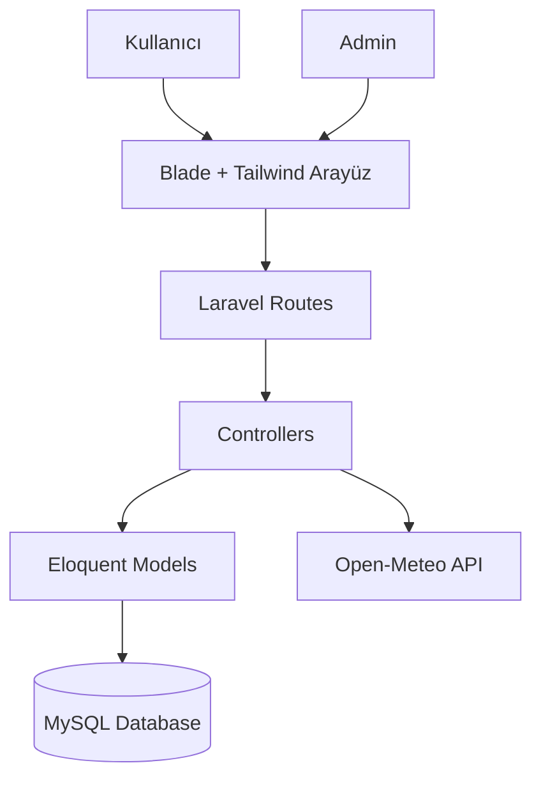
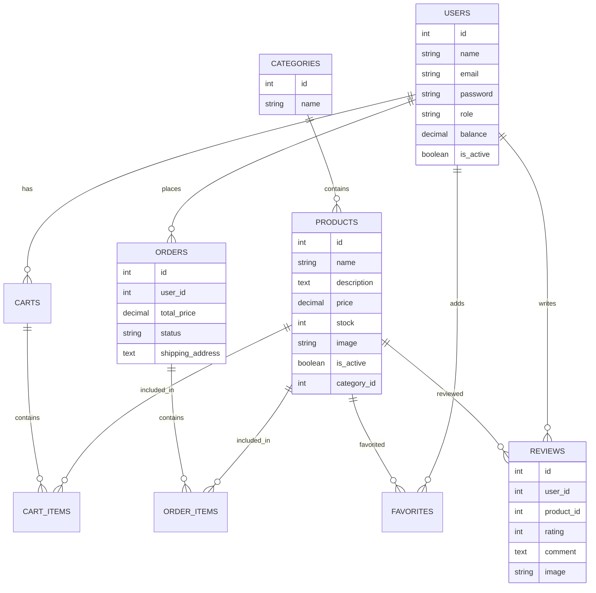
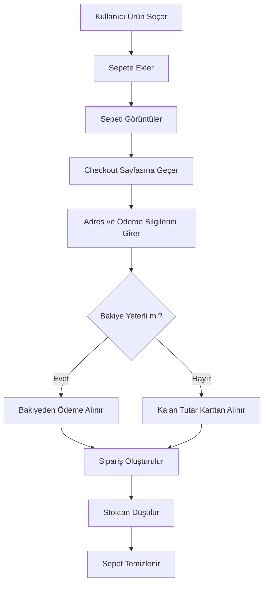
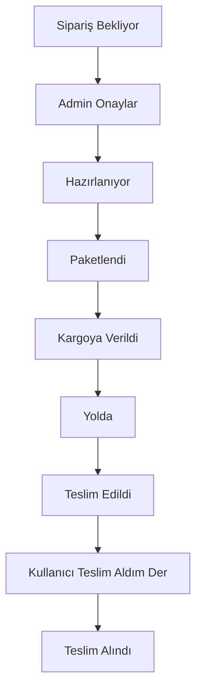
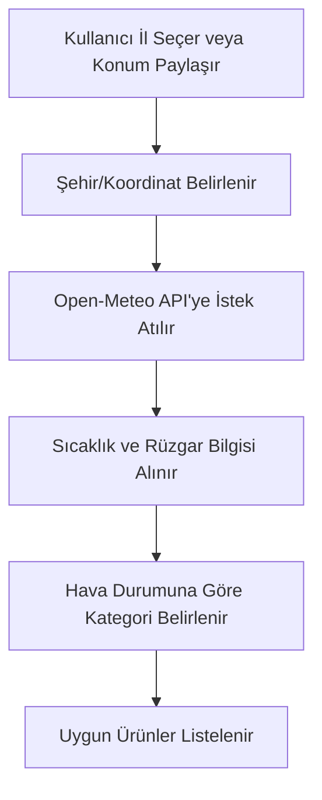

<p align="center">

  
  
  
  

  <br/>

  
  
  
  

</p>

# 🏠 Smart House Market - Akıllı Ev Ürünleri Alışveriş Sistemi

## 1. Proje Bilgileri

**Proje Adı:** Smart House Market - Akıllı Ev Ürünleri Alışveriş Sistemi

**Ders:** Web Programlama

**Framework:** Laravel

**Veritabanı:** MySQL

**Arayüz:** Blade Template Engine + Tailwind CSS

**API Entegrasyonu:** Open-Meteo Weather API

| İsim Soyisim      | Öğrenci Numarası |
| ----------------- | ---------------- |
| Emre Yasin Yıldan | 231307058        |

---

# 📌 2. Giriş ve Problem Tanımı

Günümüzde akıllı ev sistemleri, kullanıcıların yaşam alanlarını daha güvenli, konforlu ve verimli hale getiren önemli teknolojilerden biridir. Akıllı ampuller, güvenlik kameraları, sensörler, termostatlar, robot süpürgeler ve otomasyon cihazları gibi ürünler kullanıcıların günlük yaşamını kolaylaştırmaktadır.

Bu proje kapsamında geliştirilen **Smart House Market**, akıllı ev ürünlerinin tanıtıldığı, listelendiği, sepete eklenebildiği, sipariş verilebildiği ve admin paneli üzerinden yönetilebildiği web tabanlı bir alışveriş sistemidir.

Proje, Laravel MVC mimarisi kullanılarak geliştirilmiş olup iki temel kullanıcı rolü içermektedir:

* **Admin:** Sistemdeki ürünleri, kategorileri, siparişleri, kullanıcıları ve yorumları yönetir.
* **User:** Ürünleri görüntüler, favorilere ekler, sepete ürün ekler, sipariş verir, sipariş durumunu takip eder, yorum yapar ve cüzdan bakiyesi kullanabilir.

Projenin temel amaçları:

* Laravel MVC mimarisi ile sürdürülebilir bir e-ticaret sistemi geliştirmek
* Admin ve kullanıcı rollerine göre yetkilendirme sağlamak
* Ürün, kategori, sipariş, yorum ve kullanıcı yönetimi sağlamak
* Sepet, ödeme, bakiye ve iade süreçlerini uygulamak
* Dış API kullanarak hava durumuna göre ürün önerisi sunmak
* Modern ve responsive bir kullanıcı arayüzü geliştirmek

---

# 🏗️ 3. Kuramsal Arka Plan

## 3.1 MVC Mimarisi

MVC, Model-View-Controller bileşenlerinden oluşan bir yazılım mimarisidir.

| Katman     | Açıklama                                                               |
| ---------- | ---------------------------------------------------------------------- |
| Model      | Veritabanı tabloları ve ilişkileri temsil eder                         |
| View       | Kullanıcıya gösterilen arayüz katmanıdır                               |
| Controller | Kullanıcı isteklerini işler ve model-view arasındaki bağlantıyı sağlar |

Bu projede Laravel’in MVC yapısı kullanılmıştır. Örneğin ürün işlemleri için `Product` modeli, ürün sayfaları için Blade view dosyaları ve ürün yönetimi için `ProductController` kullanılmıştır.

## 3.2 Rol Tabanlı Yetkilendirme

Sistemde iki temel rol bulunmaktadır:

* **Admin**
* **User**

Admin rolündeki kullanıcılar yönetim paneline erişebilirken, normal kullanıcılar yalnızca alışveriş ve profil işlemlerini gerçekleştirebilir.

## 3.3 E-Ticaret İş Akışı

Projede klasik bir e-ticaret akışı uygulanmıştır:

1. Kullanıcı ürünleri görüntüler.
2. Ürün detayına girer.
3. Ürünü sepete ekler.
4. Checkout ekranında adres ve ödeme bilgilerini girer.
5. Sipariş oluşturulur.
6. Admin siparişi onaylar ve durumunu ilerletir.
7. Kullanıcı sipariş durumunu takip eder.
8. Teslim edildi aşamasından sonra kullanıcı “Ürünlerimi Teslim Aldım” butonuna basar.

---

# 🧱 4. Sistem Mimarisi



Bu mimaride tüm kullanıcı istekleri Laravel route sistemi üzerinden controller katmanına yönlendirilir. Controller sınıfları gerekli iş mantığını çalıştırır ve Eloquent modeller aracılığıyla veritabanı işlemlerini gerçekleştirir.

---

# 📦 5. Sistem Modülleri

## 5.1 Kullanıcı Modülü

Kullanıcı modülü, kullanıcıların sisteme kayıt olması, giriş yapması, profil bilgilerini güncellemesi ve hesabını pasif hale getirmesi işlemlerini kapsar.

### Özellikler

* Kullanıcı kayıt sistemi
* Kullanıcı giriş sistemi
* Profil güncelleme
* Hesap pasifleştirme
* Pasif kullanıcı giriş engeli
* Kullanıcı cüzdan bakiyesi

## 5.2 Admin Modülü

Admin modülü, sistemin içerik yönetim tarafını oluşturur.

### Admin İşlevleri

* Ürün ekleme, güncelleme, silme
* Kategori yönetimi
* Kullanıcı yönetimi
* Sipariş yönetimi
* Yorum yönetimi
* Sipariş durumunu ilerletme
* Kullanıcı hesaplarını aktif/pasif yapma

## 5.3 Ürün Modülü

Ürün modülü, akıllı ev ürünlerinin yönetildiği temel modüldür.

### Özellikler

* Ürün adı
* Ürün açıklaması
* Fiyat
* Stok
* Kategori
* Ürün görseli
* Satışta/pasif durumu
* Ürün detay sayfası
* Ortalama puan ve yorum bilgisi

## 5.4 Kategori Modülü

Ürünler kategorilere ayrılarak daha düzenli bir alışveriş deneyimi sağlanmıştır.

Örnek kategoriler:

* Aydınlatma
* Güvenlik
* Enerji Yönetimi
* Temizlik
* İklimlendirme
* Sensörler
* Ev Otomasyonu

## 5.5 Sepet Modülü

Kullanıcılar ürünleri adet seçerek sepete ekleyebilir ve sepet üzerinden ürünleri çıkarabilir.

### Özellikler

* Ürün sepete ekleme
* Stok kontrolü
* Sepetten ürün çıkarma
* Sepet toplamını görme
* Sipariş ekranına geçiş

## 5.6 Sipariş Modülü

Sipariş sistemi, projenin en önemli iş akışlarından biridir.

### Sipariş Durumları

| Durum      | Açıklama                   |
| ---------- | -------------------------- |
| pending    | Sipariş bekliyor           |
| approved   | Admin tarafından onaylandı |
| preparing  | Hazırlanıyor               |
| packed     | Paketlendi                 |
| shipped    | Kargoya verildi            |
| on_the_way | Yolda                      |
| delivered  | Teslim edildi              |
| received   | Kullanıcı teslim aldı      |
| cancelled  | İptal edildi               |

Admin siparişi bir buton yardımıyla aşama aşama ilerletir. Kullanıcı ise siparişi admin onaylamadan önce iptal edebilir.

## 5.7 Cüzdan ve Bakiye Modülü

Projede kullanıcı hesabına bağlı bir cüzdan sistemi geliştirilmiştir.

### Özellikler

* 50 TL, 100 TL, 200 TL, 500 TL ve 1000 TL bakiye yükleme
* Fake kart ödeme ekranı
* Sipariş iptalinde tutarın kullanıcı bakiyesine iade edilmesi
* Alışveriş sırasında önce bakiyenin kullanılması
* Bakiye yetmezse kalan tutar için kart bilgisi istenmesi

## 5.8 Favoriler Modülü

Kullanıcılar beğendikleri ürünleri favorilerine ekleyebilir ve daha sonra favori listesinden görüntüleyebilir.

## 5.9 Yorum ve Puanlama Modülü

Kullanıcılar ürünlere puan ve yorum bırakabilir.

### Özellikler

* 1-5 arası puan verme
* Yorum yazma
* Yorum görseli ekleme
* Yorum görselini büyüterek görüntüleme
* Ortalama ürün puanı
* Fotoğraflı yorum sayısı
* Yasaklı kelime filtresi
* Admin yorum yönetimi

Sistemde bir kullanıcı aynı ürüne yalnızca bir değerlendirme yapabilir. Kullanıcı tekrar yorum gönderirse önceki yorumu güncellenir. Bu yapı, sahte puan manipülasyonunu engellemek amacıyla tercih edilmiştir.

## 5.10 Chatbot Asistan Modülü

Siteye kullanıcı deneyimini artırmak amacıyla bir mini asistan eklenmiştir.

### Özellikler

* Sağ altta sabit görünür
* Sürüklenebilir yapıdadır
* Kullanıcıya hızlı yönlendirme sağlar
* Siparişler, profil, cüzdan, favoriler ve hava durumu sayfalarına yönlendirir
* Kullanıcı metin yazdığında anahtar kelimelere göre otomatik cevap üretir

## 5.11 Hava Durumu API ve Ürün Öneri Modülü

Projede Open-Meteo API kullanılarak şehir bazlı hava durumu bilgisi alınmaktadır.

### Özellikler

* Kullanıcı 81 il arasından şehir seçebilir
* Kullanıcı isterse konumunu paylaşabilir
* Konuma göre hava durumu bilgisi alınır
* Sıcaklık ve rüzgar bilgisi gösterilir
* Hava durumuna göre ürün önerileri sunulur

Örneğin:

* Soğuk havada iklimlendirme ürünleri
* Rüzgarlı havada güvenlik ve sensör ürünleri
* Normal havada ev otomasyonu ürünleri önerilir

---

# 🗃️ 6. Veritabanı Tasarımı

## 6.1 Temel Tablolar

| Tablo       | Açıklama            |
| ----------- | ------------------- |
| users       | Kullanıcı bilgileri |
| products    | Ürün bilgileri      |
| categories  | Ürün kategorileri   |
| carts       | Kullanıcı sepetleri |
| cart_items  | Sepetteki ürünler   |
| orders      | Sipariş bilgileri   |
| order_items | Sipariş ürünleri    |
| favorites   | Favori ürünler      |
| reviews     | Ürün yorumları      |

## 6.2 ER Diyagramı



---

# 🔄 7. Akış Diyagramları

## 7.1 Sipariş Oluşturma Akışı



## 7.2 Sipariş Takip Akışı



## 7.3 Hava Durumu API Akışı



---

# 🔐 8. Güvenlik ve Yetkilendirme

Projede kullanıcı güvenliği ve yetkilendirme için aşağıdaki önlemler uygulanmıştır:

* Laravel authentication yapısı kullanılmıştır.
* Admin paneli sadece admin rolüne sahip kullanıcılara açıktır.
* Normal kullanıcı admin route’larına erişemez.
* Pasif kullanıcı tekrar giriş yapamaz.
* Kullanıcı yalnızca kendi siparişlerini görüntüleyebilir.
* Kullanıcı yalnızca kendi sepeti ve favorileri üzerinde işlem yapabilir.
* Yorumlarda yasaklı kelime filtresi uygulanmıştır.
* Admin uygunsuz yorumları silebilir.

---

# 🌐 9. API Entegrasyonu

Projede dış API olarak **Open-Meteo API** kullanılmıştır.

## Kullanım Amacı

Akıllı ev ürünleri hava koşullarına göre farklı ihtiyaçlar doğurabilir. Örneğin soğuk havalarda termostat ve iklimlendirme ürünleri, rüzgarlı havalarda güvenlik kameraları ve sensörler daha önemli hale gelir.

Bu nedenle sistemde kullanıcının seçtiği veya konumdan tespit edilen şehre göre hava durumu bilgisi alınmakta ve buna göre ürün önerisi yapılmaktadır.

## Alınan Veriler

* Anlık sıcaklık
* Rüzgar hızı
* Şehir bilgisi

---

# 💻 10. Kullanılan Teknolojiler

| Teknoloji          | Kullanım Amacı                           |
| ------------------ | ---------------------------------------- |
| Laravel            | Backend ve MVC mimarisi                  |
| PHP                | Sunucu tarafı programlama                |
| MySQL              | Veritabanı                               |
| Blade              | View katmanı                             |
| Tailwind CSS       | Responsive arayüz tasarımı               |
| JavaScript         | Chatbot, tema, konum ve dinamik işlemler |
| Open-Meteo API     | Hava durumu verisi                       |
| Laravel Eloquent   | ORM ve veritabanı işlemleri              |
| Laravel Middleware | Yetkilendirme kontrolü                   |

---

# 🧪 11. Test Senaryoları

| Test                          | Beklenen Sonuç              | Durum    |
| ----------------------------- | --------------------------- | -------- |
| Kullanıcı kayıt olur          | Kullanıcı sisteme eklenir   | Başarılı |
| Kullanıcı giriş yapar         | Kullanıcı paneline yönlenir | Başarılı |
| Admin giriş yapar             | Admin paneline yönlenir     | Başarılı |
| Ürün sepete eklenir           | Sepette ürün görünür        | Başarılı |
| Stoktan fazla ürün eklenir    | Sistem izin vermez          | Başarılı |
| Sipariş oluşturulur           | Sipariş pending olur        | Başarılı |
| Admin siparişi onaylar        | Durum approved olur         | Başarılı |
| Kullanıcı siparişi iptal eder | Tutar bakiyeye iade edilir  | Başarılı |
| Bakiye ile ödeme yapılır      | Önce bakiye kullanılır      | Başarılı |
| Yorum yapılır                 | Ürün detayında görünür      | Başarılı |
| Yasaklı kelime yazılır        | Yorum engellenir            | Başarılı |
| Hava durumu API çalışır       | Şehir hava durumu görünür   | Başarılı |
| Chatbot yönlendirme yapar     | İlgili sayfaya gider        | Başarılı |

---

# 🧠 12. Tasarım Kararları

## Laravel Neden Seçildi?

Laravel, MVC yapısı, Eloquent ORM desteği, güvenlik özellikleri ve hızlı geliştirme imkanı nedeniyle tercih edilmiştir.

## Tailwind CSS Neden Kullanıldı?

Tailwind CSS, hızlı responsive arayüz geliştirme ve modern tasarım bileşenleri oluşturma konusunda esneklik sağladığı için tercih edilmiştir.

## Cüzdan Sistemi Neden Eklendi?

Proje isterlerinde sipariş iptali durumunda tutarın kullanıcının site hesabına iade edilmesi istenmiştir. Bu nedenle kullanıcı bakiyesine dayalı bir cüzdan sistemi geliştirilmiştir.

## Hava Durumu API Neden Eklendi?

Akıllı ev ürünleri çevresel koşullarla doğrudan ilişkilidir. Bu nedenle hava durumuna göre ürün önerisi yapan bir API entegrasyonu, projenin amacına uygun bir katma değer sağlamaktadır.

---

# ⚠️ 13. Karşılaşılan Problemler ve Çözümleri

| Problem                                    | Çözüm                                                       |
| ------------------------------------------ | ----------------------------------------------------------- |
| View dosyalarının yanlış klasöre konması   | Laravel view klasör yapısı düzenlendi                       |
| Ürün detay route çakışmaları               | Public ProductController ve Admin ProductController ayrıldı |
| Görsel upload yolları                      | Storage link ve asset kullanımı düzeltildi                  |
| Pasif kullanıcı tekrar giriş yapabiliyordu | LoginRequest içine aktiflik kontrolü eklendi                |
| Yorumlarda uygunsuz kelime kontrolü yoktu  | Yasaklı kelime filtresi eklendi                             |
| API SSL hatası                             | Local ortam için HTTP withoutVerifying kullanıldı           |
| Chatbot konum problemi                     | Sabit ve sürüklenebilir yapı düzenlendi                     |

---

# 📊 14. Sonuç

Smart House Market projesi, Laravel MVC mimarisi kullanılarak geliştirilmiş, admin paneli ve kullanıcı arayüzü bulunan kapsamlı bir e-ticaret sistemidir. Projede ürün yönetimi, kategori yönetimi, sepet, sipariş, ödeme, bakiye, yorum, favori, chatbot, hava durumu API entegrasyonu ve kullanıcı yönetimi gibi birçok modül başarıyla uygulanmıştır.

Geliştirilen sistem, proje isterlerinde belirtilen admin/user rol yapısı, ürün yönetimi, sipariş takibi, ödeme ekranı, bakiye iadesi, kullanıcı hesap yönetimi, responsive tasarım ve API kullanımı gibi gereksinimleri karşılamaktadır.

Proje sürecinde Laravel framework yapısı, MVC mimarisi, veritabanı ilişkileri, Blade template sistemi, API entegrasyonu ve kullanıcı deneyimi tasarımı konularında önemli kazanımlar elde edilmiştir.

---

# 📚 15. Kaynakça

* Laravel Documentation: [https://laravel.com/docs](https://laravel.com/docs)
* PHP Documentation: [https://www.php.net/docs.php](https://www.php.net/docs.php)
* MySQL Documentation: [https://dev.mysql.com/doc/](https://dev.mysql.com/doc/)
* Tailwind CSS Documentation: [https://tailwindcss.com/docs](https://tailwindcss.com/docs)
* Open-Meteo API Documentation: [https://open-meteo.com/](https://open-meteo.com/)
* Mermaid Diagrams: [https://mermaid.js.org/](https://mermaid.js.org/)

---

# 🚀 16. Kurulum ve Çalıştırma

```bash
git clone <repo-url>
cd smart-home-market
composer install
npm install
cp .env.example .env
php artisan key:generate
php artisan migrate
php artisan db:seed
php artisan storage:link
npm run build
php artisan serve
```

Proje çalıştırıldıktan sonra:

```text
http://127.0.0.1:8000
```

adresinden erişilebilir.

---

# ✅ 17. Proje Özellik Özeti

* Admin/User rol sistemi
* Ürün CRUD işlemleri
* Kategori yönetimi
* Ürün görsel yükleme
* Sepet sistemi
* Sipariş sistemi
* Sipariş durum takibi
* Cüzdan ve bakiye sistemi
* Fake ödeme ekranı
* Favoriler
* Ürün detay sayfası
* Yorum ve puanlama
* Fotoğraflı yorum sistemi
* Admin yorum moderasyonu
* Hava durumu API entegrasyonu
* Hava durumuna göre ürün önerisi
* Konum destekli hava durumu
* Chatbot asistan
* Dark/Light tema
* Pagination
* Responsive tasarım
